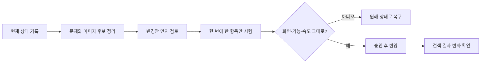

# 뷰티블라썸 SEO·AEO 개선 프로젝트

한국어·영어·일본어·중국어 간체·번체 사이트의 검색 정보를 정리하고, 이미지 품질을 개선하면서도 **디자인·기능·속도를 보호**하기 위한 통합 저장소입니다.

> 현재 단계: 조사 결과와 기획안 정리. 아임웹 사이트에는 아직 수정·저장·게시하지 않았습니다.

## 먼저 읽을 문서

1. [목표와 원칙](docs/01-PRD.md)
2. [사용 도구](docs/02-TECH-STACK.md)
3. [자료와 작업 구조](docs/03-ARCHITECTURE.md)
4. [전체 작업 순서](docs/04-WORKFLOW.md)
5. [Claude Code 작업 지시](docs/05-CLAUDE-CODE-INSTRUCTIONS.md)
6. [검수 기록](docs/06-REVIEW-LOG.md)
7. [그림으로 보는 프로젝트](docs/PROJECT-MAP.md)

## 현재까지 확인한 핵심 사실

- 5개 언어에서 요청한 URL 530개를 점검하고, 중복·외부 이동·콘텐츠가 아닌 응답을 분리해 일반 HTML 최종 URL 479개를 분석했습니다.
- 영어 소프웨이브 페이지가 만든 언어 연결 중 한국어·간체·번체 URL 3개가 실제 HTTP 404였습니다.
- 77개 URL에서 `<title>`이 두 개 이상 출력됐습니다.
- 5개 언어 모두 `/`와 `/home`의 위젯 ID·종류·텍스트 순서가 같지만, 각각 자신을 대표 주소로 표시합니다.
- 479개 URL의 JSON-LD는 JSON 문법 파싱 오류가 없었습니다. 이는 내용의 정확성이나 검색 노출 자격을 보장하지 않습니다.

## 저장소에 포함한 자료

- `audit/reports/`: 읽기 쉬운 1차 진단과 수정 전 코드 리뷰
- `audit/data/`: 집계 JSON과 검증한 URL 기록
- `audit/inventories/`: 페이지·제목·이미지·헤딩 목록
- `tools/`: 저장 자료를 다시 검사하는 코드
- `assets/`: 향후 승인된 이미지 시안과 교체 기록

공개 HTML 원본 전체, 임시 파일, 인증 정보, 관리자 원문 전체는 저장소에 올리지 않습니다. 원본 전체는 로컬 보관 대상으로 분리하며, 필요한 증거는 해시와 출처로 추적합니다.

## 절대 규칙

- 저장·게시 전 변경 내용을 먼저 검토합니다.
- 디자인, 예약, 메뉴, 언어 이동, 상담 기능을 깨뜨리지 않습니다.
- 같은 조건에서 속도 저하가 확인되면 적용하지 않습니다.
- 숨겨진 키워드나 확인되지 않은 의료 문구를 추가하지 않습니다.
- 자동 게시, 자동 제출, 권한 변경을 하지 않습니다.
