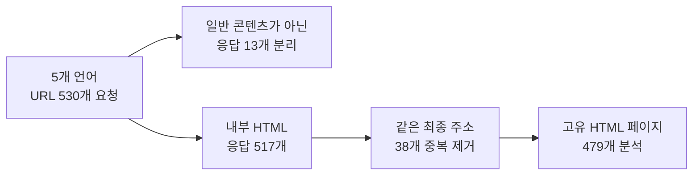
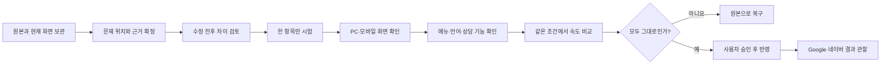
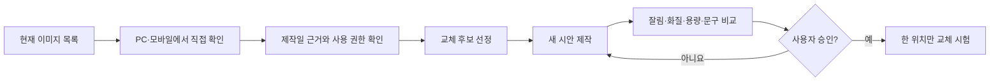
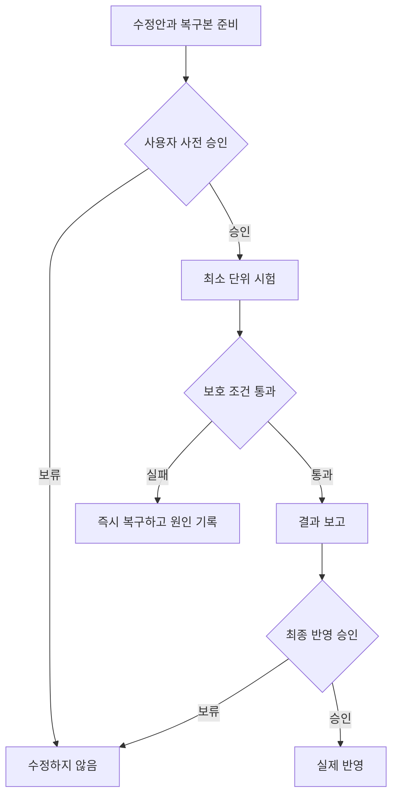

# 뷰티블라썸 Google·네이버 SEO·AEO 개선 기획 보고서

작성일: 2026년 9월 5일  
대상: 한국어·영어·일본어·중국어 간체·번체 사이트  
현재 상태: 조사와 기획 단계 · 아임웹 수정·저장·게시 전

## 먼저 말씀드릴 결론

이번 프로젝트에서 가장 먼저 할 일은 새로운 SEO 코드를 많이 넣는 것이 아닙니다. 이미 사이트에서 출력되고 있는 검색 정보 가운데 **잘못 연결된 주소, 한 페이지에 여러 번 나오는 제목, 서로 다른 대표 주소**를 차례로 바로잡는 일이 우선입니다.

조사 과정에서는 5개 언어 사이트의 URL 530개를 요청했고, 중복과 일반 콘텐츠가 아닌 응답을 분리한 뒤 479개의 고유 HTML 페이지를 분석했습니다. 이 과정에서 실제로 열리지 않는 다국어 연결 3개와 복수 제목이 출력되는 페이지 77개를 확인했습니다. 반면 JSON-LD는 479개 페이지에서 JSON 문법 오류가 없었습니다. 따라서 구조화 데이터가 전혀 없다고 보고 새 코드를 덧붙이는 접근은 맞지 않습니다.

작업은 눈에 잘 띄지 않는 검색 정보부터 시작하되, 화면·기능·속도 가운데 하나라도 나빠지면 적용하지 않겠습니다. 이미지 개선은 같은 저장소에서 관리하지만 기술 SEO와 분리해 검토하겠습니다. 그래야 문제가 생겼을 때 원인을 정확히 찾고 원래 상태로 되돌릴 수 있습니다.

## 조사 범위가 어떻게 정리되었는지

| 구분 | 확인한 내용 | 이번 판단에서의 의미 |
|---|---:|---|
| 요청한 URL | 530개 | 사이트맵 URL과 언어별 루트 주소를 포함한 조사 범위입니다. |
| 고유 HTML 최종 URL | 479개 | 중복과 일반 콘텐츠가 아닌 응답을 제외한 실제 분석 대상입니다. |
| 복수 `<title>` 페이지 | 77개 | 페이지 위젯에서 문서 제목이 추가로 출력되는 구조를 확인했습니다. |
| 추가 `<title>` 요소 | 143개 | 정상 제목 외에 더 출력된 제목 요소의 수입니다. |
| 잘못 연결된 소프웨이브 URL | 3개 | 영어 `/107`이 만든 한국어·간체·번체 주소가 실제 HTTP 404였습니다. |
| JSON-LD 문법 오류 | 0개 | 문법은 통과했지만 내용의 정확성과 검색 노출 자격은 별도 검토가 필요합니다. |
| 인라인 JavaScript 정적 문법 오류 | 0개 | 1,470개 고유 조각의 실행 없는 문법 검사 결과이며, 실제 동작과 속도 검증은 아닙니다. |

태국어 사이트는 이번 단계에 포함하지 않습니다. Search Console과 네이버 서치어드바이저의 색인·노출·클릭 자료도 아직 연결하지 않았으므로, 현재 자료만으로 검색 순위의 원인이나 개선 폭을 단정하지 않겠습니다.

## 지금 확인된 문제와 우선순위

### 1순위 — 실제로 열리지 않는 언어 연결

영어 소프웨이브 `/107`은 같은 경로 번호를 다른 국가 도메인에도 그대로 붙이고 있습니다. 하지만 같은 시술이라도 언어마다 페이지 번호가 다릅니다.

| 언어 | 현재 만들어지는 주소 | 확인 결과 | 실제 소프웨이브 주소 |
|---|---|---:|---|
| 한국어 | `beautyblossom.kr/107` | 404 | `/139` |
| 영어 | `en.beautyblossom.kr/107` | 200 | `/107` |
| 일본어 | `jp.beautyblossom.kr/107` | 200 | `/107` |
| 중국어 간체 | `cn.beautyblossom.kr/107` | 404 | `/108` |
| 중국어 번체 | `tw.beautyblossom.kr/107` | 404 | `/139` |

이 사례는 추정이 아니라 브라우저에서 생성된 링크와 각 URL의 HTTP 응답을 대조해 확인했습니다. 해결 방법은 경로를 자동 복사하는 코드를 또 추가하는 것이 아니라, 시술별 5개 언어 대응표를 먼저 완성하고 실제로 검증된 주소만 사용하도록 바꾸는 것입니다.

### 2순위 — 한 페이지에 여러 번 나오는 문서 제목

77개 페이지에서 `<title>`이 두 개 이상 출력되고 있습니다. 한국어 보톡스 `/28`, 영어 소프웨이브 `/107`, 한국어 소프웨이브 `/139`에서는 구체적인 위젯 위치도 확인했습니다.

현재 브라우저의 `document.title`은 정상 첫 제목입니다. 따라서 검색 결과 제목이 이미 잘못 노출됐다고 확대 해석하지는 않겠습니다. 다만 페이지 본문 위젯 안에 별도 문서의 `<head>`와 `<title>`이 들어간 구조는 정리할 근거가 충분합니다. 화면을 만드는 CSS·HTML·스크립트는 그대로 두고, 불필요한 문서 메타데이터만 제거하는 최소 수정안을 먼저 만들겠습니다.

### 3순위 — 홈페이지 대표 주소와 설명문

5개 언어 모두 `/`와 `/home`의 위젯 구성과 텍스트 순서가 같습니다. 그런데 두 주소가 각각 자기 자신을 대표 주소로 선언하고 있습니다. 어느 주소를 남길지는 기존 내부 링크, 사이트맵, 실제 색인 상태를 확인한 뒤 정해야 합니다. 확인 전에는 `/home`을 삭제하거나 강제로 이동시키지 않겠습니다.

한국어 홈페이지 설명문은 키워드 나열에 가깝고, 영어 홈페이지 설명문은 관리자 입력과 공개 출력의 끝부분이 다릅니다. 설명문은 임의의 글자 수 공식에 맞추기보다, 아임웹에서 실제로 어떻게 출력되는지 확인하면서 완결된 문장으로 정리하겠습니다.

### 추가 확인이 필요한 항목

- 사이트맵의 상품 경로 10개는 HTTP 200이지만 구매 불가 안내 스크립트만 반환합니다. 검색 노출 목적과 아임웹 설정을 확인한 뒤 처리하겠습니다.
- 이미지 `alt` 누락과 빈 값은 출현 횟수로 집계했습니다. 장식 이미지의 빈 `alt`는 정상일 수 있으므로 일괄 입력하지 않겠습니다.
- 구조화 데이터는 이미 여러 유형이 출력되고 있습니다. 화면에 보이는 내용과 같은 사실을 말하는지, 페이지 주제와 맞는지를 별도로 확인하겠습니다.
- 성능은 아직 같은 조건의 반복 측정을 하지 않았습니다. JavaScript 문법 검사 통과를 속도 검증으로 표현하지 않겠습니다.

## 프로젝트 진행 방식

### 0단계 — 복구할 수 있는 상태부터 만듭니다

실제로 수정할 관리자 필드와 코드 위젯의 원문을 먼저 보관합니다. 페이지 주소, 언어, 메뉴 위치, 위젯 ID, 수집 날짜와 복원 위치를 함께 적겠습니다. 공개 HTML 사본은 관리자 입력 원문과 다를 수 있으므로 복구본으로 대신 사용하지 않습니다.

이 단계가 끝나지 않으면 다음 단계로 넘어가지 않습니다.

### 1단계 — 변경 전 기준선을 남깁니다

PC와 모바일의 같은 화면 크기에서 주요 페이지를 기록합니다. 메뉴, 언어 이동, FAQ, 슬라이더, 상담 링크가 어떻게 작동하는지도 확인합니다. 실제 예약 제출이나 메시지 전송, 구매는 하지 않습니다.

속도는 한 번의 점수만 보지 않고 같은 조건에서 반복 측정합니다. 새로운 외부 라이브러리, 타이머, 전역 DOM 탐색을 추가하지 않는 것을 기본 원칙으로 삼겠습니다.

### 2단계 — 5개 언어 페이지 대응표를 완성합니다

페이지 번호가 같다는 이유로 같은 시술이라고 판단하지 않습니다. 페이지 제목, 화면 내용, canonical, HTTP 응답을 함께 확인한 뒤 대응 관계를 기록합니다. 없는 페이지와 대응 페이지를 찾지 못한 경우도 억지로 연결하지 않고 별도 상태로 남기겠습니다.

첫 시험 후보는 오류가 가장 구체적으로 재현된 영어 소프웨이브 `/107`입니다. 다만 실제 적용은 대응표와 관리자 원문 백업을 검토받은 뒤 진행합니다.

### 3단계 — 제목 중복을 최소 범위로 정리합니다

복수 제목 77개를 위젯별로 묶어 같은 원인이 반복되는지 확인합니다. 수정 전에는 원문과 제안 코드를 나란히 보여드리고, 제거하는 태그와 보존하는 요소를 구분해 설명하겠습니다.

첫 시험에서는 `<title>`과 문서용 메타 요소만 대상으로 삼습니다. 디자인 DOM, CSS 클래스, 이미지, 글꼴, 이벤트 연결, 슬라이더와 상담 기능은 변경 대상에서 제외합니다.

### 4단계 — 홈페이지 주소와 검색 설명을 정리합니다

Google과 네이버의 실제 등록 상태를 확인해 `/`와 `/home` 중 대표 주소를 결정합니다. 내부 링크와 사이트맵도 같은 주소를 가리키는지 대조하겠습니다.

검색 설명문은 병원의 실제 위치와 확인 가능한 진료 범위를 바탕으로 작성합니다. 효능, 유지 기간, 안전성, 후기, 평점은 확인 자료와 병원 검수 없이 새로 만들지 않습니다.

### 5단계 — AEO는 내용의 일치부터 점검합니다

AEO를 별도의 마법 같은 코드로 다루지 않겠습니다. 검색엔진과 답변형 시스템이 참고할 수 있도록 다음 세 가지를 맞추는 작업으로 보겠습니다.

1. 페이지에 실제로 보이는 설명
2. 제목·대표 주소·언어 연결 같은 검색 정보
3. 구조화 데이터가 전달하는 병원·시술·FAQ 정보

FAQ와 의료 정보는 화면에서 확인할 수 있고 병원이 검수한 내용만 사용합니다. 기존 JSON-LD가 있다는 사실을 무시하고 같은 스키마를 중복 삽입하지 않습니다. `llms.txt`나 특별 AI 태그는 확인된 검색 오류보다 뒤에 검토합니다.

### 6단계 — 이미지 개선은 별도 검수선에서 진행합니다

“AI처럼 보인다”는 인상만으로 이미지를 폐기하지 않습니다. 얼굴의 비대칭, 손가락 형태, 머리카락 경계, 피부 질감, 빛과 그림자, 의료 장면의 현실성처럼 눈으로 확인할 수 있는 이유를 기록하겠습니다.

2025년 11월 이전 제작 여부도 URL 이름으로 추정하지 않습니다. 원본 파일의 메타데이터, 제작 기록 또는 업로드 기록이 있는 경우에만 확정하겠습니다. 새 이미지는 사용 권한, 표시 크기, 파일 용량, 모바일 잘림, 대체 설명을 함께 검토합니다.

### 7단계 — 승인된 항목만 넓혀갑니다

시험 페이지에서 화면·기능·속도가 유지되고 검색 정보가 의도대로 출력될 때만 같은 원인의 다른 페이지로 확대합니다. 한 번에 여러 문제를 묶지 않으며, 각 변경은 별도 diff와 검수 기록을 남깁니다.

## 완료 여부를 판단하는 기준

| 확인 분야 | 통과 기준 |
|---|---|
| 검색 정보 | 의도한 제목과 대표 주소가 모순 없이 출력되고, 언어 연결은 실제 200 페이지를 가리킵니다. |
| 디자인 | 같은 조건의 PC·모바일 비교에서 수정 때문에 생긴 레이아웃·글꼴·이미지·간격 변화가 없습니다. |
| 기능 | 메뉴, 언어 이동, FAQ, 슬라이더, 상담 링크가 기존처럼 작동합니다. |
| 속도 | 같은 조건의 반복 측정에서 의미 있는 악화를 확인하지 못한 경우에만 통과로 판단합니다. |
| 복구 | 모든 변경에 관리자 원문, 변경 이유, 영향 범위와 복원 방법이 연결되어 있습니다. |
| 이미지 | 사용 권한과 제작 근거를 확인하고, PC·모바일 잘림과 용량 검사를 통과한 승인본만 사용합니다. |
| 성과 관찰 | 재수집 뒤 선택 canonical, 색인, 노출, 클릭을 확인하되 순위 상승을 완료 조건으로 보장하지 않습니다. |

## 역할을 나누는 방법

| 담당 | 맡을 일 |
|---|---|
| 사용자 | 우선순위, 의료 표현, 이미지 시안, 시험 적용과 최종 반영을 승인합니다. |
| Codex | 사실관계를 확인하고 기획·코드 리뷰·검수 결과를 정리합니다. 기존 파일을 바꾸기 전 차이를 먼저 보여드립니다. |
| Claude Code | 승인된 범위의 코드 초안과 검사용 파일을 작업합니다. 라이브 아임웹에 자동 저장하거나 게시하지 않습니다. |
| 아임웹 관리자 작업 | 승인된 변경만 최소 단위로 적용하며, 저장이 즉시 공개되는지 먼저 확인합니다. |

## 보고서와 작업 기록을 남기는 방식

모든 작업은 GitHub의 기능별 브랜치와 PR로 분리합니다. 검색 정보 수정, 이미지 시안, 검수 기록을 한 커밋에 뒤섞지 않겠습니다. PR에는 다음 내용을 빠짐없이 적습니다.

- 어느 국가·페이지·위젯을 다루는지
- 확인된 문제와 근거가 무엇인지
- 원문과 변경안이 어떻게 다른지
- 디자인·기능·속도에 영향을 줄 가능성이 있는지
- 어떤 검사를 통과했는지
- 문제가 생기면 어떻게 복구하는지

## 시작 전에 결정할 세 가지

1. Google Search Console과 네이버 서치어드바이저를 읽기 전용으로 확인할 수 있는지
2. 각 언어 홈페이지의 대표 주소를 `/`와 `/home` 중 어디로 정할지 판단할 자료가 있는지
3. 첫 시험 대상으로 영어 소프웨이브 `/107`을 사용해도 되는지

위 세 가지가 정리되면 관리자 원문 백업과 기준선 기록부터 시작하겠습니다. 그전에는 사이트 코드, 이미지, 권한을 변경하지 않습니다.

## 근거 자료와 공식 기준

- [공개 사이트 1차 진단과 재현 기록](../audit/reports/INITIAL-AUDIT-KO.md)
- [감사 수치 원본](../audit/data/summary.json)
- [원본 증거 파일 해시 목록](../audit/data/source-evidence-manifest.csv)
- [Google 다국어 페이지 안내](https://developers.google.com/search/docs/specialty/international/localized-versions)
- [Google 제목 링크 안내](https://developers.google.com/search/docs/appearance/title-link)
- [Google 대표 URL 안내](https://developers.google.com/search/docs/crawling-indexing/consolidate-duplicate-urls)
- [Google 생성형 AI 검색 안내](https://developers.google.com/search/docs/fundamentals/ai-optimization-guide)
- [네이버 콘텐츠 마크업 안내](https://searchadvisor.naver.com/guide/markup-content)

## 문체 가이드 적용 범위

이 보고서는 `iam-not-ai` 스킬의 상투적인 AI 표현을 줄이는 원칙만 참고했습니다. 스킬 안의 블로그 글자 수, 발행 시간, 이미지 수 같은 노출 공식은 이번 기술 SEO 기획에 사용하지 않았습니다. 실제 경험이 없는 내용을 경험담처럼 쓰거나, 확인되지 않은 의료·마케팅 표현을 만드는 방식도 제외했습니다.
