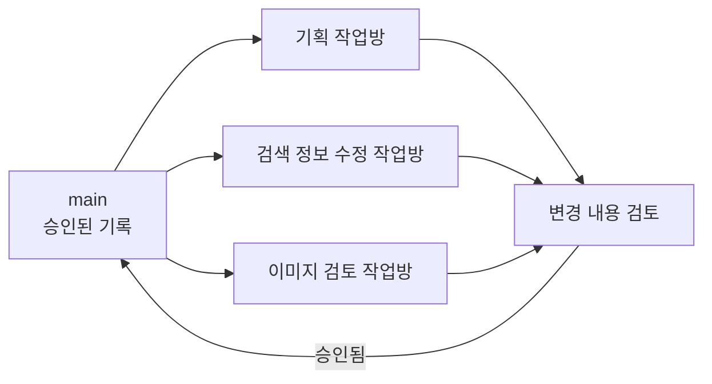
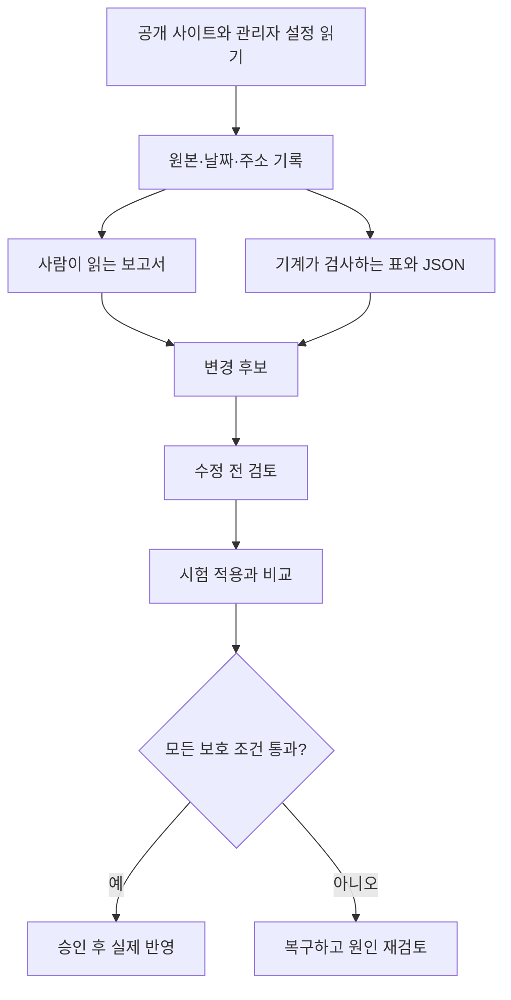

# 3. 자료와 작업 구조

## 저장소 구성

```text
beautyblossom-seo-aeo/
├─ README.md                   처음 보는 사람을 위한 안내
├─ docs/                       목표·도구·구조·작업순서·검수 기록
├─ audit/
│  ├─ reports/                 사람이 읽는 진단 보고서
│  ├─ data/                    집계와 검증 결과
│  └─ inventories/             페이지·제목·이미지·헤딩 목록
├─ assets/
│  ├─ candidates/              교체 검토 대상 목록과 미리보기
│  ├─ proposals/               새 시안
│  └─ approved/                승인된 최종 이미지와 사양
├─ tools/                      자료를 재검사하는 코드
└─ tests/                      보고서 수치와 파일 연결을 검증
```

이미지 폴더에는 저작권·초상권·사용 승인을 확인한 파일만 둡니다. 실제 환자나 의료진 사진은 별도 동의와 사용 범위를 확인하기 전 저장소에 올리지 않습니다.

## 브랜치와 작업방



- `main`: 검토가 끝난 문서와 자료만 보관합니다.
- 기능별 브랜치: 기획, 검색 코드, 이미지를 서로 분리합니다.
- 워크트리: 각 브랜치를 별도 폴더에서 작업해 섞이지 않게 합니다.
- 변경 검토: 수정 전후 차이와 검사 결과를 확인한 뒤 `main`에 합칩니다.

## 자료가 움직이는 방식



## GitHub에 올리지 않는 자료

- 로그인 쿠키, 토큰, 계정 정보
- 관리자 원문에 포함될 수 있는 민감정보
- 전체 공개 HTML 182MB와 임시 브라우저 자료
- 사용 승인이 확인되지 않은 인물 원본

전체 HTML을 제외하더라도 검사 결과가 어디서 나왔는지 알 수 있도록 URL, 수집 시점, 해시, 요약 기록을 남깁니다. 복구가 필요한 관리자 원문은 민감정보를 점검한 별도 보관 방식이 준비된 뒤 다룹니다.
