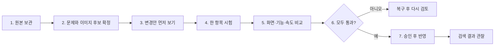

# 4. 전체 작업 순서

## 1단계 — 원본 보관

- 수정할 관리자 필드와 위젯 원문을 먼저 보관합니다.
- 페이지 주소, 메뉴 위치, 위젯 ID, 수집 날짜를 함께 기록합니다.
- 공개 HTML 사본을 관리자 복구본으로 착각하지 않습니다.

## 2단계 — 문제와 이미지 후보 확정

- 이미 확인한 404 언어 연결, 복수 title, 홈 대표 주소를 우선합니다.
- 이미지마다 사용 페이지, 표시 크기, 모바일/PC 위치, 대체 설명, 파일 용량을 기록합니다.
- “AI 같다”는 느낌만 적지 않고 얼굴·손·머리카락·피부·그림자·의료 장면에서 무엇이 부자연스러운지 구체적으로 표시합니다.
- 2025년 11월 이전 제작 여부는 제작 기록이나 원본 메타데이터로 확인하며 URL만 보고 단정하지 않습니다.

## 3단계 — 변경안 먼저 보기

- 코드: 변경 전후 차이, 이유, 영향 범위, 복구 방법을 제시합니다.
- 이미지: 기존 화면, 새 시안, 모바일 잘림, 용량 비교를 함께 제시합니다.
- 타이틀 이미지는 장식용 문구와 검색엔진이 읽어야 할 실제 HTML 제목을 구분합니다.

## 4단계 — 한 항목 시험

- 한 번에 하나의 검색 신호나 이미지 슬롯만 변경합니다.
- 여러 문제를 묶어 수정하지 않아 원인을 추적할 수 있게 합니다.
- 초안 저장이 즉시 공개되는지 아임웹 동작을 먼저 확인합니다.

## 5단계 — 비교 검사

- 모바일과 PC의 같은 크기·같은 위치에서 변경 전후 화면을 비교합니다.
- 메뉴, 언어 이동, FAQ, 슬라이더, 상담 링크를 확인합니다.
- 실제 예약 제출·메시지 전송·구매는 하지 않습니다.
- 같은 조건에서 여러 번 측정해 로딩과 화면 흔들림이 나빠지지 않았는지 확인합니다.

## 6단계 — 통과 또는 복구

- 검색 신호가 맞아도 디자인·기능·속도 중 하나가 나빠지면 승인하지 않습니다.
- 문제가 있으면 새 수정 위에 덧붙이지 않고 보관한 원본으로 복구합니다.

## 7단계 — 승인 후 반영과 관찰

- 사용자 승인 후에만 실제 사이트에 반영합니다.
- Google과 네이버가 다시 수집한 뒤 선택한 대표 주소, 색인, 노출, 클릭 변화를 확인합니다.
- 검색 도구 제출과 알림 등록도 별도 승인 없이 자동화하지 않습니다.

## 현재 진행 위치

- 완료: 5개 언어 공개 소스 1차 감사와 핵심 오류 재현
- 진행: 조사 자료와 기획 저장소 구성
- 다음: 관리자 원문 백업 방식과 이미지 후보 판정표 확정
- 미착수: 사이트 코드·이미지 실제 변경 및 게시
