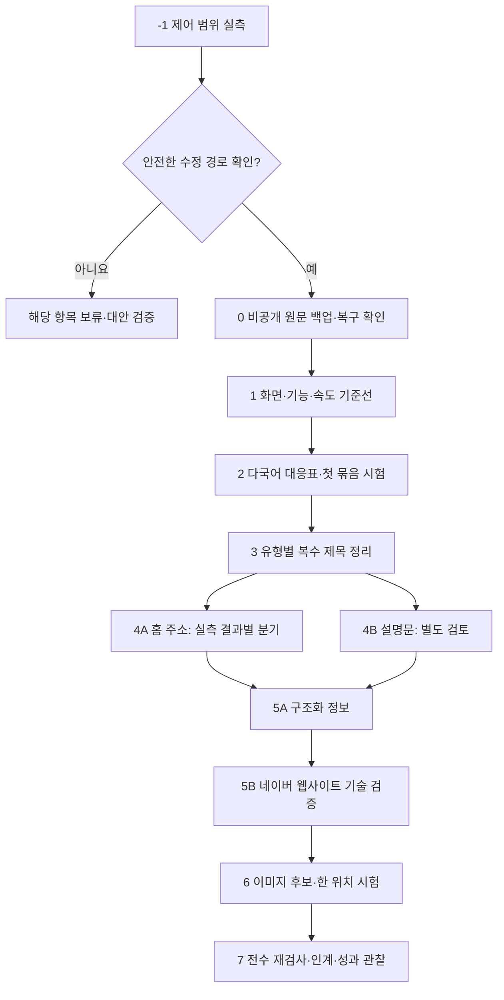
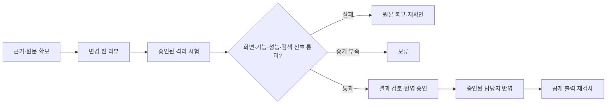

# 4. 전체 작업 순서와 일정

개정일: 2026-09-06. -1~7단계를 공통 번호로 사용합니다. 현재 완료된 것은 공개 소스 1차 조사와 기획 검수입니다. 아래 실측·시험·사이트 반영은 아직 수행하지 않았습니다.

## 초기 일정과 PR 단위

PR은 변경 내용을 묶어 검토하는 단위입니다. R01~R09는 계획상의 식별자이며 실제 GitHub 번호가 아닙니다. 이번 기획 PR #1 이후 **기본 9개, 첫 시험을 분리하면 10개 PR**을 예상합니다.

| 단계 / 계획 ID | 예상 실작업 | PR 산출물 | 통과 조건 |
|---|---:|---|---|
| -1 / R01 제어 범위 | 1~2일 | 5언어 설정·위젯·canonical·hreflang·저장 영향 실측표 | 가능·불가·보류 및 안전한 경로를 증거로 구분 |
| 0 / R02 원문 보관 | 0.5~1일 | 비공개 백업의 공개 가능 색인·해시·복구 기록 | 원문·복원 위치·복구 시험·2차 사본 확인 |
| 1 / R03 기준선 | 1일 | PC·모바일 화면·기능 검사, 각 5회 성능 원자료 | 같은 조건으로 재현 가능 |
| 2 / R04 언어 연결 | 2~3일 | 대응표, 태그 규칙 적용안, 소프웨이브 묶음 시험 | 5개 언어 자기·상호참조 및 안전 검수 |
| 3 / R05 복수 제목 | 2~4일 | 143위젯 유형별 변경안과 적용·검수 상태 | 대표 유형 시험 후 확대, 479 URL 재검사 |
| 4 / R06 홈·설명 | 1~2일 | 4A 제어 결과별 결정서, 4B 설명문 차이 | 미검증 수단을 전제하지 않음. 보류 항목 명시 |
| 5 / R07 정보 일치 | 1~2일 | 5A 구조화 정보 대조, 5B 네이버 5호스트 기술 검증 | 근거 없는 의료 정보 없음, 미확인 상태 별도 기록 |
| 6 / R08 이미지 시험 | 1~2일 | 우선 후보 최대 3개와 승인된 1위치 시안·시험 | 권한·제작일 근거·잘림·용량·기능·속도 검수 |
| 7 / R09 마감 검수 | 1~2일 | 재검사, 목표 대비 결과, 미해결 목록, 인계서 | 기술 완료·플랫폼 보류·검색엔진 관찰 대기 구분 |
| 선택 / R04-P | 위 시간에 포함 | 첫 시험을 별도 PR로 검토할 때 | PR 분리이며 기간 중복 가산 아님 |

합계는 **10.5~19 인일(계획상 약 11~19 실작업일)**입니다. 1인일은 한 담당자의 8시간입니다. 이는 확정 견적이 아닌 초기 추정으로, -1단계와 관리자 원문 대조 뒤 수정 건수·검수 범위를 반영해 다시 산정합니다. 위젯 143개를 수동 처리해야 한다면 같은 추정을 그대로 유지하지 않습니다.

접근·격리 시험 환경·백업이 준비된다는 전제에서 **첫 시험 목표는 착수 후 5~8 영업일**입니다. 2단계 전체 대응표보다 소프웨이브 한 묶음을 먼저 확정합니다. 사용자·병원 승인 대기, 플랫폼 문의, 추가 접근 준비, 검색엔진 재수집 시간은 제외합니다.

이미지 일괄 제작·전 페이지 교체, 태국어, 플레이스·블로그 운영은 위 일정에 포함하지 않습니다. 구조화 정보에서 광범위한 수정이 필요하면 표본 검토 기간을 전체 수정 완료 기간으로 사용하지 않고 재산정합니다.

## 4A 대표 주소 작업은 -1단계에 종속됩니다

- A: 기존 자동 canonical을 안전하게 편집·대체 가능 → 단일 출력 검증 후 직접 수정안.
- B: 추가만 가능, 기존 태그 제거 불가 → 추가 삽입안 금지. 다른 지원 수단을 검증.
- C: 편집·추가 모두 불가 → 태그 수정안 중단. 내부 링크·사이트맵·주소 이동 가능 여부는 별도로 확인.
- U: 실측 불가·미확인 → 실제 적용 보류.

다른 수단까지 모두 막히면 관측·지원 문의 준비만 합니다. 설명문 4B는 독립적으로 검토합니다. 대표 주소를 선정하는 일과 실제로 그 신호를 바꿀 수 있는 일은 다릅니다. [상세 게이트](07-IMPLEMENTATION-POLICIES.md)

## 첫 시험과 확대

영어 소프웨이브 /107이 첫 후보입니다. 제목 수정과 언어 연결 수정은 별도 시험으로 나눕니다. title만 시험하면 위젯 하나부터, hreflang이면 한국어 /139·영어 /107·일본어 /107·간체 /108·번체 /139를 묶어 검사합니다.

복수 제목은 139개 문서 묶음형과 4개 부분 문서형에 공통 수정 절차를 먼저 설계합니다. 템플릿 공유 여부를 몰라도 설계할 수 있지만, 자동으로 head·body 전체를 삭제하지는 않습니다. 진행률은 143위젯, 영향 검수는 77페이지 기준입니다.

속도는 PC·모바일 각각 전후 5회 중앙값으로 비교합니다. **LCP +10% 초과 또는 CLS 0.1 초과는 반려**합니다. 그 이하라도 재현 가능한 악화가 있으면 통과시키지 않습니다. 기준선부터 실패하면 기존 문제와 구분해 기록하고 적용을 보류합니다.

## 역할과 마감

Codex는 조사·작업 지시·검수, Claude Code는 승인된 수정안 구현, 사용자는 범위·의료 표현·이미지·실제 반영 승인을 맡습니다. GitHub 문서 병합은 아임웹 저장·게시 승인이 아닙니다. 자동 클릭·자동 게시·자동 제출·권한 변경은 하지 않습니다.

막힌 항목에는 원인, 필요한 자료, 담당자, 다음 확인 조건을 적습니다. 독립된 안전 항목의 기획은 계속할 수 있습니다. 7단계의 기술 검수와 반영 후 2·4·8주 검색 도구 관찰은 구분합니다. 이 일정은 자동 모니터링 예약이 아닙니다.

[실행·검수 기준](07-IMPLEMENTATION-POLICIES.md) · [검수 답변서](../audit/reports/2026-09-06-REVIEW-RESPONSE-KO.md)
