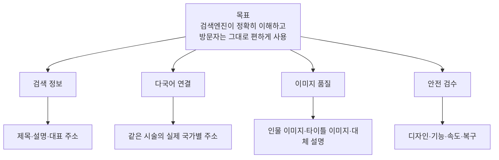
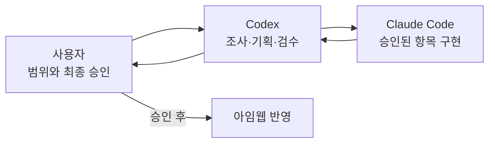
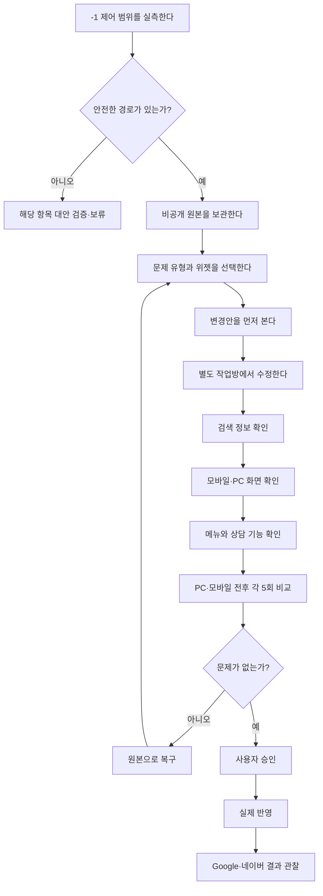
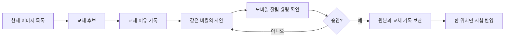

# 그림으로 보는 프로젝트

## 무엇을 다루는가

## 누가 무엇을 하는가

## 안전하게 바꾸는 흐름

## 이미지 교체 흐름

“오래됐다”거나 “AI처럼 보인다”는 말만으로 교체하지 않습니다. 제작 근거, 어색한 부분, 페이지 역할, 저작권·초상권, 속도 영향을 함께 기록합니다.

단계별 기간과 기본 9~10개 PR은 [작업 순서](04-WORKFLOW.md), canonical 분기·다국어 규칙·성능 수치는 [실행·검수 기준](07-IMPLEMENTATION-POLICIES.md)을 따릅니다. 네이버는 웹사이트 기술 검증만 별도 트랙으로 진행합니다.
